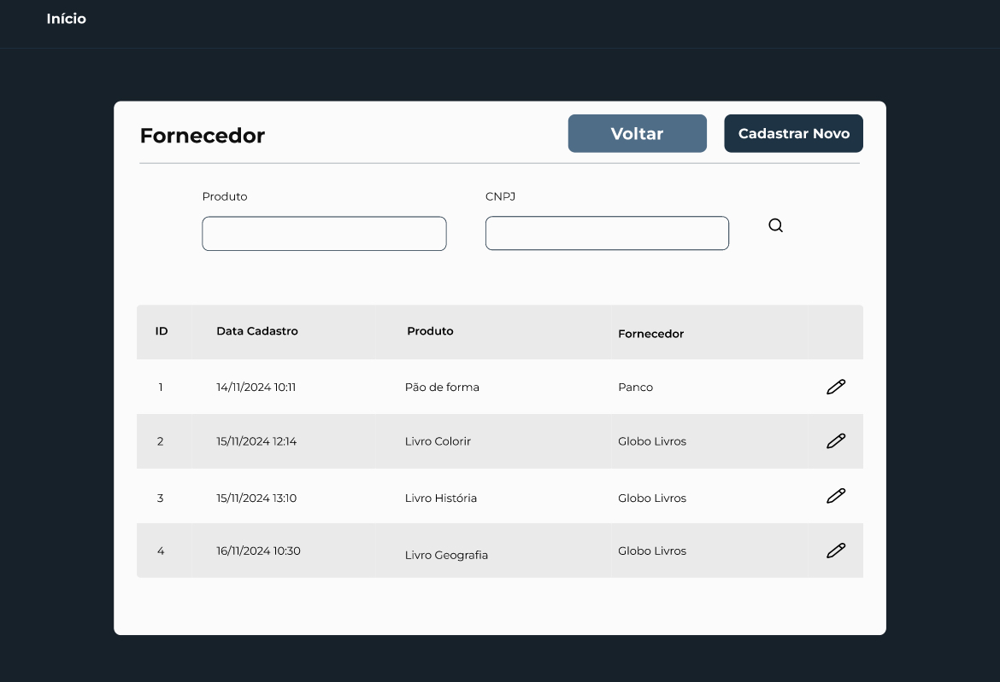

# Jornada:

*Pessoa Física:*
- Cadastro e Consulta de Professores
- Cadastro e Consulta de Alunos
- Verificar Documento

*Pessoa Jurídica:* ​
- Cadastrar e Consultar Fornecedores
- Consultar informações do CNPJ
- Verificar e cadastrar produtos fornecidos

*Professores:*
- Consulta de Departamentos cadastrados
- Modificação de dados Pessoais
- Cadastro de Novos Professores
 ​
*Fornecedores:* ​
- Consultar e cadastrar dados pessoais do Fornecedores
- Altera os dados

*Alunos:*
- Consultar dados pessoais do Aluno
- Altera os Dados
- Identifica as matérias que o aluno está cadastrado

*Matricula:*

- Cadastro das matérias 

# Prototipação da tela inicial:

# Prototipação:

## Link prototipação: 
[Figma](https://www.figma.com/design/RKzQXyTxSzX6q9LCPgE6vK/PI?node-id=0-1&t=mhex3V4tjRp2cRx0-1)
